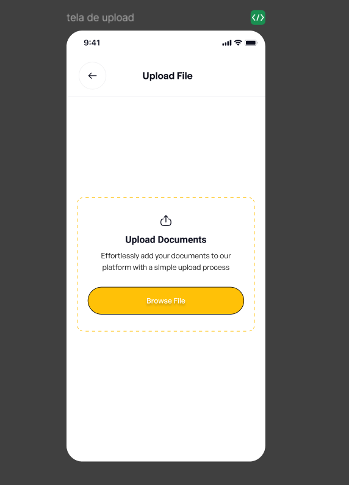
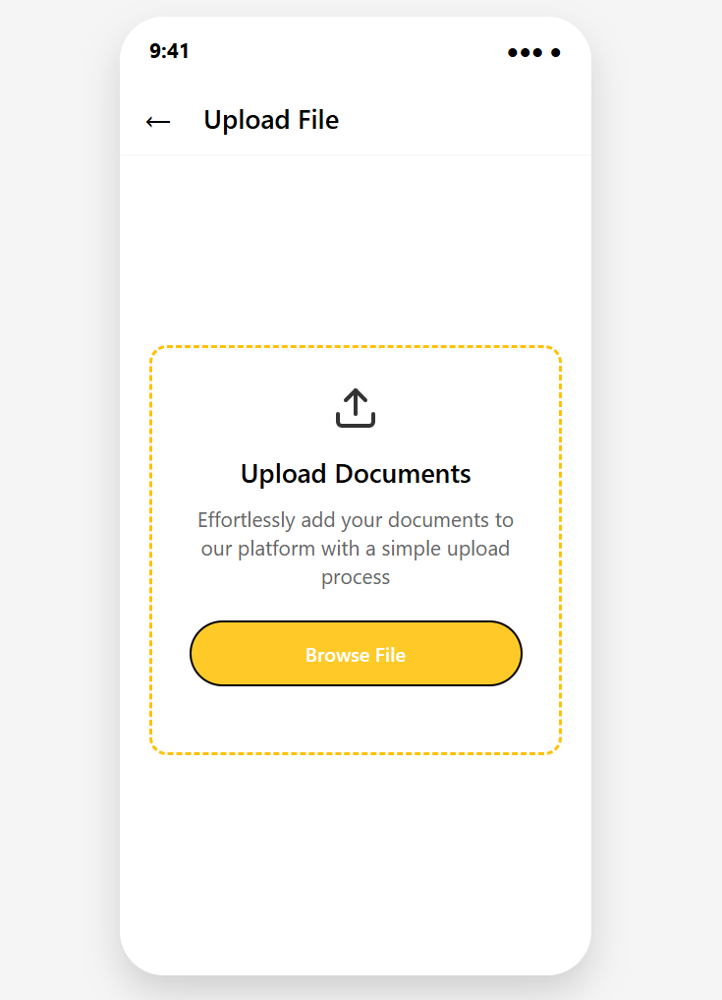
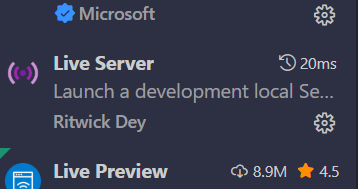
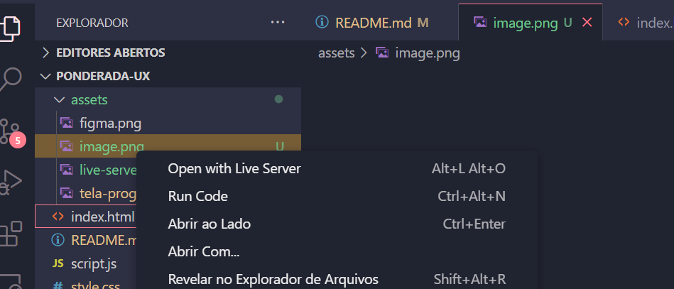

# Atividade: Componente de Interface para App Mobile

## 📌 Exercício
&emsp; Projetar um componente de interface para app mobile no Figma e desenvolvê-lo (usando React Native ou simulação via HTML/CSS). O design deve usar Auto Layout e o Dev Mode para guiar a implementação com base nas medidas, estilos e estrutura de código gerada.

- **Autora**: Karine Victoria Rosa da Paixão
- **Figma**: [link](https://www.figma.com/design/vEPaSjNyr75EEWLHrZxs0J/Ponderada?node-id=0-1&t=gNR9164SVtvJCgae-1)

## 📝 Relato
&emsp;  O componente foi desenvolvido usando HTML, CSS e JavaScript. Além disso, a codificação foi feita com base na prototipação do Figma. Uma das diversas funcionalidades que ajudaram no processo de codificação foi o Dev Mode, que auxiliou nas medidas, na estilização e na estrutura do código, e o Auto Layout, que permitiu que o protótipo ficasse proporcional.

&emsp; É importante frisar que, por mais que tenham sido usadas as medidas corretas, não foi possível fazer uma cópia perfeita, já que alguns dos elementos visuais não eram compatíveis com o código e, por isso, foram adaptados.

&emsp;  A estrutura de codificação inicial foi feita com o auxílio de IAs. Posteriormente, muitos dos detalhes, como cores, proporções, fontes e medidas, foram ajustados diretamente no código com base no que foi definido no Figma.

- Imagem da prototipação do figma: 

Figura 1 - Prototipação no figma 

Fonte: Material produzido pela autora (2025)

- Imagem de produto codificado: 

Figura 2 - Produto codificado 

Fonte: Material produzido pela autora (2025)

## 📝 Guia de visualização

Para acessar a tela, é necessario seguir o passo a passo a seguir:

- 1. Baixar a extensão live server

 Figura 3 - Live server 

Fonte: Material produzido pela autora (2025)

- 2. Acessar o index.html e apertar o botão direito do mouse

 Figura 4 - Live server 

Fonte: Material produzido pela autora (2025)

- 3. Acessar o "Open with live server"

- 4. Selecionar um arquivo e testar o componente

### Revisão

&emsp; A revisão dos textos e código foi feita com auxilio de IAs: [DeepSeek](https://chat.deepseek.com/) e [Claude.ai](https://claude.ai)
